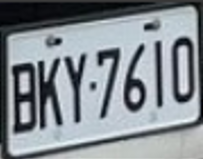

# 車牌辨識系統
## 介紹
適用於架設在路邊的科技執法攝影機，自動辨識車牌字元。
## 前提
必須先使用yolov7進行車牌追蹤與擷取，才能使用此車牌辨識系統。

 

>  追蹤並框出車牌

 

>將車牌擷取
>開始進行車牌辨識

## 問題
由於我們的攝影機是架設在路邊，所以拍攝出來的車牌會是斜的，車牌角度會嚴重影像Tesseract-OCR的字元辨識，所以必須將照片轉正。
## 解決方法
使用Python結合OpenCV做仿射變換，將照片轉正。要使用這項技術必須得到車牌的三個角座標。

 
> 仿射變換的前後對比

## 影像處理流程
### 1. 尺寸調整
先將原圖進行尺寸的調整，每一張照片尺寸一樣，後續的參數才會適合每一個車牌。

 

### 2. 調整亮度與對比度
調整對比度，減少亮暗的差異，降低光線，提亮陰影。

 

### 3. 灰階化
以利後續的Sobel運算。

 

### 4. 高斯模糊
過濾掉一些微小的噪聲，讓圖像更加乾淨。

 

### 5. Sobel運算子
因為我們發現車頭的裝飾物幾乎都是水平線條，所以我們只計算垂直的邊緣，找到車牌左右邊界，再進行後續的處理。

 

### 6. 二值化
明確物體的邊界，讓線條更清晰。

 

### 7. 找出輪廓
先找出輪廓，再計算每個輪廓的最小矩形、與最小矩形的長度。經過研究發現車牌框長度大概介於圖片的63%~83%之間，也就是以85這個高度來區分車牌框，15是過濾細小輪廓，我們以15跟85這兩個參數來區分車牌框。

 

### 8. 裁切
找出左右框之後，切出藍色區域的最小x軸與最大x軸，這樣就完成車牌框裁切了。

 

### 9. 侵蝕
切出車牌字元之後，就開始進行形態學操作，先使用侵蝕消除圖像中的小白躁點。

 

### 10. 膨脹
填補圖像中的小孔或連接相鄰的輪廓，特別是水平膨脹，使用1X7的矩形結構元素，迭代9次以確保字元與字元之間能閉合。

 

### 11. 計算最小矩形
使用大於2500面積的輪廓計算最小矩形，過濾其他不必要的輪廓，得到矩形四角座標。

 

### 12. 仿射變換
將照片轉正

 

### 13. 裁切
減少上框與圖釘的干擾

 

### 14. Tesseract-OCR字元辨識
最後處理成功。
進行字元辨識。完成整個車牌辨識的流程。

 

## 展示
這裡展示的是兩種角度的不同車牌，最後處理效果與辨識結果，可以看到大部分的車牌都能有好的處理結果，辨識結果的準確度就會很高。

|原圖|結果|原圖|結果|
|----|----|----|----|
||||
||||
||||

## 文字辨識問題
可以看到這裡車牌的3都被辨識成5。BNT·6302這張是正向的車牌去做影像處理但是辨識結果也是錯的，所以可以得知並不是角度的問題。
|錯誤車牌|
|----|
||
||
||
||
Tesseract OCR 的預設英語（eng）訓練數據集包含了多種常見的字體，像是Times new roman、Arial字體。但是可以看到我們台灣的新式車牌字體，與常見的字體會有些許不同，像是3這個字就差很多。所以後續我們會使用Tesseract-LSTM模型進行車牌字體的訓練，針對特別的字去做一些微調，希望能將系統的辨識準確度提高到9成以上。

|台灣新式車牌字體|Times New Roman|
|----|----|
|||

